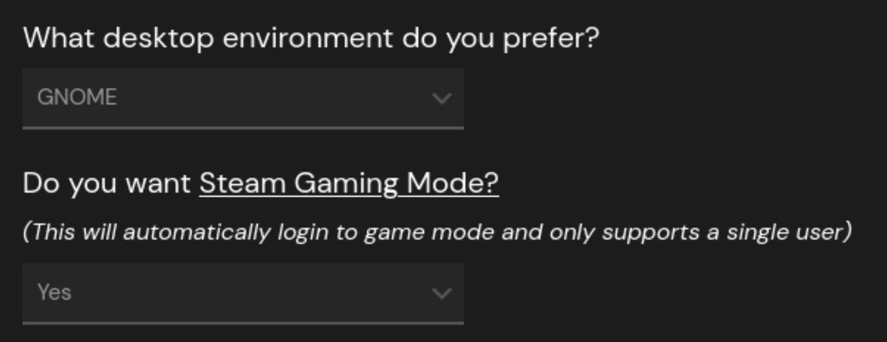

# BAZZITE DESKTOP FULL SWITCHER
This is a script is created specifically for Bazzite where desktop environment is set to  GNOME and Steam Gaming Mode selected to yes (your computer automatically starts with steam gamemode).

The idea of this is for you to have a simple way to convert your gaming computer/handheld into a regular desktop PC without loosing both features.

# Description
With this script or "button", you can change the behavior of your Bazzite computer/handheld to start in full GNOME mode instead of the steam gamemode, this will allow you to use GNOME login system and screen lock feature, making your computer to work more like a desktop instead of a console, without loosing that feature all together as you can switch between modes anytime without even needing to restart your PC.

The GNOME login and screen lock mechanism is also more secure that simply changing to desktop mode, as in the regular desktop mode you don't have any login steps after going to sleep.

## Inspiration
In my case, I have a Lenovo Legion Go that I use as my personal computer/tablet/laptop, so there are times where I don't even carry the controllers around and can spent days without gaming, I use it a lot to read comic books and code, so I rather to have something closer to a laptop login that entering Steam Menu all the time, and I feel more safe leaving my computer access behind a password.

# What exactly it does?
## Theory
Bazzite comes installed with two different display managers; SDDM ([Simple Desktop Display Manager](https://github.com/sddm/sddm/)) and GDM ([GNOME Display Manager](https://wiki.gnome.org/Projects/GDM)). SDDM takes care of all the Gamemode login and it's the only one that is normally working. So by changing the display manager to GDM, regular GNOME will start.

Gamemode also uses two sessions types wayland, and x11, x11 it's for gameode and wayland for desktop mode. We can use this information (by using `$XDG_SESSION_TYPE`) to choose what to do when launching our script and automating our options.

## 3 file system
We use a 3 file system to achieve our goal:

**The switcher script**
- Description: This is the script that will make the display manager switch. (maybe I can use a flag so this calls the service)
- located at: `/var/usrlocal/bin/bazzite_switcher.sh`
    
**Switch Service**
- Description: Service to that will run the script (a service is needed to be use or session will not be terminated correctly).
- located at: `/etc/systemd/system/bazzite_switcher.service`

**App Drawer**
- Description: A desktop file use so the app can be launched from the GNOME app drawer.
- located at: `/usr/share/applications/bazzite_switcher.desktop`

## Other comments
we add `your_username ALL=(ALL) NOPASSWD: /var/usrlocal/binbazzite_switcher.sh` to visudo so we don't have a password prompt.
